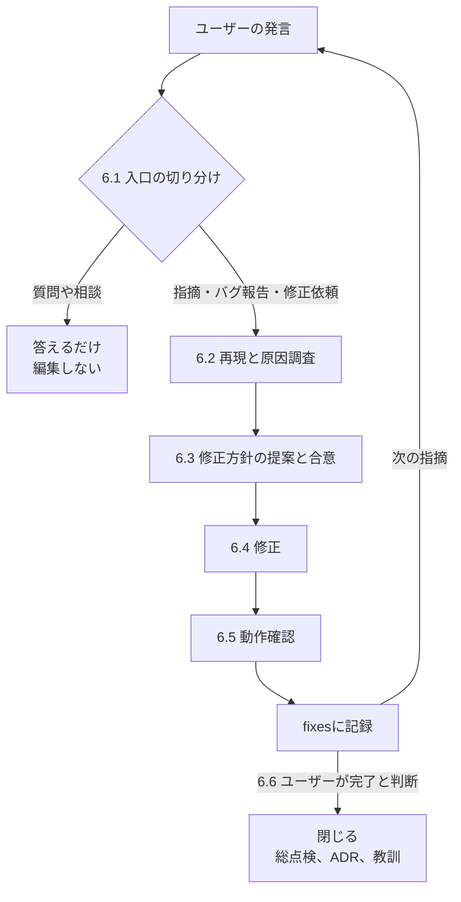

# AIの行動原則

このスキルにおけるAIの行動原則

## 禁止事項

このワークフローでは以下の行為を一切禁止とする

- 本番環境の**変更・デプロイ**
- 許可なくリモートリポジトリにブランチをpushする
- ユーザーの質問・指摘に対して、方針の合意を取らずにファイルを編集すること

## 行動規範

- ユーザーの注意力・ワーキングメモリは有限である。できる限り簡潔に応答すること。認知負荷を下げること。
- 質問に対しては簡潔な結論をまず述べること。補足があれば結論の後に述べること。
- 質問に回答する際は context7 や web検索 で最新情報の裏取りを行うこと。
- ユーザーへ質問をする際は、2~3つのアプローチを提示し、それぞれのトレードオフと推奨事項を明記する
- ユーザーへの応答で図を提示したくなったらmermaidではなくASCIIで書くこと。CUIではmermaidがレンダリングされない。

## 文章規範

文章を作成するときの規範

- `/japanese-tech-writing` スキルの方針に従い、人間とAIどちらも理解しやすいように記述すること
- 箇条書き、表、コードブロック、Mermaidを積極的に利用し、構造・関係・流れを視覚化する
- コードブロックにはファイルパスを必ず付記する。外部ライブラリのコードの参照の場合はリポジトリのURLを付記する。
- 箇条書きや表でパラメータを一覧する場合は、そのパラメータがどのサービスのどの設定ファイルなのかを必ず付記する
- Mermaidの利用用途
  - `flowchart` : コンポーネント間の関係
  - `sequenceDiagram` : API、deploy、認証などの時系列
  - `stateDiagram-v2` : 状態遷移
  - `erDiagram` : テーブルのリレーション、データモデルの概念説明
  - `classDiagram` : クラス・オブジェクトの依存関係
  - `architecture-beta` : アーキテクチャ図


# AIワークフロー

非自明なタスクを進める際の標準ワークフローを定義する。

## ワークフロー全体像

1. **設計** - ユーザーと共同で設計を行う
2. **実装計画** - 設計を細かいタスクに落とし込む
3. **実装** - 実装計画に沿って実装する
4. **ADR記録** - このワークフローでの重要な設計判断をドキュメントに残す
5. **教訓の抽出** - このワークフローで受けた指摘を一般化しauto memoryに残す
6. **確認・修正フェーズ** - ユーザーが実装や動作を確認してAIに質問や修正依頼を行う

## このワークフローで作成される主なファイル

- 設計 (`spec`) : `agent-tasks/<ブランチ名>/<TOPIC>/spec.md`
- 実装計画 (`plan`) : `agent-tasks/<ブランチ名>/<TOPIC>/plan.md`
- 修正経緯 (`fixes`) : `agent-tasks/<ブランチ名>/<TOPIC>/fixes.md`
- 設計判断 (`adr`) : `docs/adr/<TICKET_ID>_<TITLE>.md`

## Red Flags — 手が滑っているサイン

以下が一つでも当てはまったら**止まって該当工程に戻る**。

- `spec.md` / `plan.md` を書かずに実装を始めようとしている
- テストを実行せず「たぶん動く」で完了にしようとしている
- 指定スキルを起動せず、要約や記憶で代替しようとしている

## 1. 設計

ユーザーと共同で設計を行う。

- 設計書(`spec.md`)を保存する場所: `agent-tasks/<ブランチ名>/<TOPIC>/spec.md`

### 情報収集と概念の理解

設計は正確な情報を前提に行わなければならない。

- 与えられたタスクに必要な情報(コード、ドキュメント、最新のコミット)をリポジトリ内から収集すること
- 対応するチケットがあればチケットの説明やコメントも参照すること
- 外部サービスやライブラリの仕様はcontext7(mcp)もしくはweb検索で最新の情報を調査すること。知識のカットオフ時点と推奨構成やオプションが変わっていることがある。

### ブレインストーミング

収集した正しい情報を元にユーザーと共同で設計判断を行う

- ブレインストーミングでは要件定義->基本設計->詳細設計の順でそれぞれ必要事項を話し合う
  - 要件定義 (業務上の必要)
    - 目的 : なんのためにこのタスクを行うのか。解決したい課題や達成したい目標。
    - 達成基準 : なにができたらこのタスクは成功なのか (テスト戦略と関連する)
    - 制約条件 : 環境、既存コードとの整合性、禁止事項
    - スコープ/非スコープ : やらないことの明確化
    - 業務要件: As-Is/To-Be業務フロー、業務ルール(判断基準、承認ルート)、役割分担
    - 機能要件 : 必要な機能(機能一覧、概念データモデリング、権限設計)
    - 非機能要件 : 性能、セキュリティ、可用性、運用・保守
  - 基本設計 (アーキテクチャ)
    - 技術選定
    - 構成 : インフラ構成, ネットワーク構成, ミドルウェア・プラグイン構成, マイクロサービス構成
    - 処理フロー : マイクロサービスアーキテクチャのような複数コンポーネントをまたぐような処理のフロー
    - 認証認可方式
    - API設計
    - DBの論理設計
    - エラーハンドリング
    - ロギング
    - バッチ・ジョブ設計
    - UIUX設計
    - DBの論理設計
    - テスト・動作戦略 : 仕様に沿っていることをどうやって確認するか。これが達成基準になる
    - CICD設計
  - 詳細設計
    - クラス設計 (DDD, SOLID原則)
    - 処理フロー
    - 単体テスト仕様
    - 具体的な設定
- 設計にはテスト・動作確認の戦略を含めること。正しい動作を事前に定義し成功基準を明確にすること
- ドキュメントの修正や新規作成もスコープに含めること
- **設計の基本原則**に従うこと
  - **シンプル第一**: YAGNIを徹底すること。ただし、将来的な機能追加に対して拡張が容易な設計としなければならない。
  - **最小限の影響**: 必要な箇所だけに手を加える。バグの混入を避ける
  - **怠慢の禁止**: 現在の実装に引きずられたり、一時しのぎの修正を行わない。シニアアーキテクトの基準で長期的に運用・拡張が容易なアーキテクチャとすること
  - **深い洞察**: 表面的な問題の解決を目指すのではなく、問題の根本原因を見つけ、設計レベルでの改善を考えること
  - **普遍的な設計原則への準拠**: Clean Architecture, DDD, TDD, SOLIDの原則, GoFデザインパターンといった普遍的な設計原則に準拠すること

### 設計書の作成

ブレインストーミングで合意した仕様を設計書(`spec.md`)に書き起こす

- 大項目は「目次」「要件定義」「基本設計」「詳細設計」


### 設計レビュー

問題があればその場で修正すること、ただし、ユーザーと会話されていない設計判断が必要な箇所はユーザーに確認する

- `spec.md` が完成したら一度すべての内容を確認し、ブレインストーミングでユーザーと決めた仕様・設計に準拠しているかを確認する。
- 「TODO」「TBD」、未完成のセクション、曖昧な要件、矛盾がないかを確認する

---

## 2. 実装計画

エンジニアが当社のコードベースに関する知識を全く持たず、センスも疑わしいことを前提として、設計から包括的な実装計画を作成する。  

各タスクでどのファイルを変更する必要があるか、コード、テスト、確認する必要のあるドキュメント、テスト方法など、エンジニアが必要とするすべての情報を文書化する。
DRY, YAGNI, TDD, 頻繁なコミットを心がけること

- 実装計画(`plan`)を保存する場所: `agent-tasks/<ブランチ名>/<TOPIC>/plan.md`

### ファイル構造

タスクを定義する前に、どのファイルが作成または変更されるのか、そしてそれぞれのファイルがどのような役割を担うのかを明確にする。  
この定義はタスク分解の重要な指針となる。各タスクはそれぞれ独立してテスト、承認・否認できる必要がある。

- 各ファイルには明確な役割が一つだけ割り当てられるべきである。多機能な大きなファイルよりも、小さくて目的に特化したファイルが望ましい
- 既存のコードベースでは、原則として確立されたパターンに従うこと

### タスクの粒度

- タスクとは、独立してテスト可能な最小単位である。
- 「レビュアが隣接するタスクを承認しつつ、一方のタスクを一方のタスクを否認できるか」がタスクの分割基準
- 準備・設定・ドキュメントは、それを必要とする成果物のタスクに含める。

### 実装計画のヘッダ文
すべての計画は、この見出しから始めなければなりません。

````markdown
# [機能名] 実装計画

**Goal:** [何を構築するのかを一文で記述]

**Architecture:** [アプローチについて 2〜3 文で記述]

**Tech Stack:** [主要な技術・ライブラリ]

**Spec:** [この計画が実装対象とする仕様書/設計書へのパス — 計画は仕様書を根拠に論を展開するため、仕様書は計画と常にセットで扱う。実行者は両方を読むこと]

## 全体制約 (Global Constraints)

[仕様書に記載されたプロジェクト全体の要件 — バージョン下限、依存関係の制限、命名規則および文言規則、プラットフォーム要件 — を 1 項目 1 行で、仕様書から正確な値をそのまま転記する。すべてのタスクの要件には、このセクションが暗黙的に含まれる。]
````

### タスク構造


````markdown
### タスク N: [コンポーネント名]

**Files:**
- Create: `exact/path/to/file.py`
- Modify: `exact/path/to/existing.py:123-145`
- Test: `tests/exact/path/to/test.py`

**Interfaces:**
- Consumes: [このタスクが先行タスクから利用するもの — 正確なシグネチャ]
- Produces: [後続タスクが依存するもの — 正確な関数名、引数と戻り値の型。各タスクの実装者は自分のタスクしか見えないため、このブロックが隣接タスクで使われる名前と型を知る唯一の手段となる。]

- [ ] **Step 1: 失敗するテストを書く**

```python
def test_specific_behavior():
    result = function(input)
    assert result == expected
```

- [ ] **Step 2: テストを実行して失敗することを確認する**

Run: `pytest tests/path/test.py::test_name -v`
Expected: FAIL with "function not defined"

- [ ] **Step 3: 最小の実装を書く**

```python
def function(input):
    return expected
```

- [ ] **Step 4: テストを実行して成功することを確認**

Run: `pytest tests/path/test.py::test_name -v`
Expected: PASS

- [ ] **Step 5: コミット**

```bash
git add tests/path/test.py src/path/file.py
git commit -m "feat: add specific feature"
```
````

### 実装計画の禁止事項

全てのステップには、エンジニアが必要とする実際の内容が含まれていなければならない。  
以下が書いてあった場合、実装計画の作成は失敗。絶対に書かないこと

- 「TBD」「TODO」「後で実装」「詳細を記入」
- 「適切なエラー処理を追加する」「検証を追加する」「例外的なケースを処理する」
- 「テストコードを作成すること」(実際のテストコードを書いていない)
- 「タスクNと同様」
- 手順を示さずにやるべきことだけを説明しているステップ (コードステップにはコードブロックが必要)
- タスク内で定義されていない型、関数、またはメソッドへの参照

### 実装計画レビュー

実装計画 (`plan.md`)を作成したら、改めて設計書(`spec.md`)と照らし合わせて以下の観点でレビューする

- **網羅性** : 設計書(`spec.md`)の各セクションに対応するタスクが存在しているか
- **禁止事項** : 実装計画(`plan.md`)が「実装計画の禁止事項」に定めた禁止事項に抵触していないか
- **ドリフト** : 設計書(`spec.md`)の合意に矛盾する実装がないか

問題が見つかった場合は、その場で修正すること。再レビューする必要はない。修正して次に進むこと。  
仕様要件にタスクが設定されていない場合は、タスクを追加すること。

## 3. 実装

`plan.md` の各タスクをサブエージェントに委任し、実装を完遂させる。サブエージェントは人間に判断を仰がず、タスク単位で自己完結して実装・テスト・コミットまで行う。

### 3.1 委任順序

`plan.md` に記載された順に、タスクを1件ずつ委任する。前のタスクの完了(テストPASS・コミット)を確認してから次のタスクを委任する。

### 3.2 サブエージェントへの指示

タスクごとにAgentツールで1回呼び出す。指示には以下を含める。

| 要素 | 内容 |
|---|---|
| タスク本文 | `plan.md` の該当タスクブロック(Files/Interfaces/Steps)を丸ごと転記する |
| 参照資料 | `spec.md` へのパス。背景理解と、判断が必要な場面での根拠として使う |
| 自律性の指示 | 「ユーザーに質問せず、3.3の優先順位に従って自分で判断し、テストのPASSとコミットまで完遂すること」 |
| 禁止事項の再掲 | 本番環境の変更・無許可のpushなど。サブエージェントは `CLAUDE.md` を読まない前提で明記する |
| 報告フォーマット | 3.5 の項目をそのまま指示に含める |

### 3.3 判断の優先順位

タスク実行中に判断が必要になった場合、以下の優先順位で自分で決定し、立ち止まらない。

1. `spec.md` の記述
2. `plan.md` の記述
3. 既存コードの規約・パターン
4. 一般的な設計原則 (SOLID, DRY, YAGNI)

これは「戦術的な実装判断」(変数名、内部構造、エラーハンドリングの書き方、plan記述の細部の補完など)を指す。`spec`/`plan` の前提そのものを変えるような判断も止めずに進めてよいが、3.4 の報告で必ず「逸脱」として明記する。

### 3.4 ハードストップ

以下に該当する場合のみ作業を止めて報告する。判断を仰ぐのではなく「やらない」だけであり、待ち状態は発生しない。

- 本番環境の変更・デプロイが必要になった
- 許可なくリモートにpushが必要になった
- 必要な認証情報・アクセス権がない等、判断では解決できない外部要因が発生した

### 3.5 完了報告

各タスク完了時、サブエージェントは以下を報告する。

```markdown
## タスクN報告

- 判断: 独自に下した判断とその根拠(3.3の優先順位のどれを使ったか)
- 逸脱: spec/planの前提から外れた点(なければ「なし」)
- テスト: 実行したテストコマンドと結果
- コミット: コミットハッシュとメッセージ
```

全タスク完了後、蓄積した報告をユーザーに提示する。逸脱があった場合は、ユーザーの合意を得てから `spec` `plan` をあるべき姿に更新する。

## 4. 重要な設計判断をドキュメントに残す

重要な設計判断を[MADR (Markdown Architectural Decision Records)](https://adr.github.io/madr/) を利用して、 `docs/adr/<TICKET_ID>_<TITLE>.md` に残す。

- 今回の修正において、重要と思われる設計判断を抽出し、どれをADRに残すかをユーザーと相談する
- テンプレートはfullとminimalの2パターン。内容に応じて選択する。 (基本は minimal。fullでないと説明しきれない場合のみfull)
  - minimal: https://raw.githubusercontent.com/adr/madr/refs/tags/4.0.0/template/adr-template-minimal.md
  - full: https://raw.githubusercontent.com/adr/madr/refs/tags/4.0.0/template/adr-template.md
- ADRは日本語で記述する
- ADRのレビューとcommitはユーザーにゆだねる。

## 5. 教訓の抽出

ワークフロー内でユーザーから受けた指摘で、一般的に他のタスクにも適用すべきものを教訓として auto memory に残す。

- 教訓は本質的な学びとなるよう抽象化し、関連する既存メモリと結びつける
- auto memory を一度俯瞰し、必要であれば教訓の統合や廃止を行う

## 6. 確認・修正フェーズ

実装まで完了した段階でユーザーによる確認・修正フェーズに入る

- 修正経緯(`fixes`)を保存する場所: `agent-tasks/<ブランチ名>/<TOPIC>/fixes.md`

### このフェーズの原則

- **合意なく編集を始めない** : 質問や相談は答えるだけで終わらせ、修正は方針の合意を得てから着手する
- **`spec` と `plan` は「あるべき姿」に保つ** : 修正によって変更された設計や実装を `spec` `plan` に反映する

### フロー



### 6.1 入口の切り分け

ユーザーの発言をまず2つに分類する。

**質問や相談に対していきなり修正を始めてはならない。** 相談は修正の依頼ではない。

| 入口 | 例 | 進め方 |
|------|---|--------|
| 質問・相談 | 「なぜこの実装にしたのか」「Aのほうがよくないか」 | 答えるだけ。コードもドキュメントも触らない |
| 指摘・バグ報告・修正依頼 | 「XXが動かない」「XXをYYに修正して」 | 6.2に進む |

- 相談の中に修正の意図が混ざっていて判断がつかない場合は、修正するかどうかをユーザーに確認する。推測で着手しない
- 指摘が複数同時に来た場合は `agent-tasks/<ブランチ名>/<TOPIC>/fixes.md` に一覧化し、優先度を合意してから1件ずつ回す。まとめて着手すると、どの変更がどの結果をもたらしたかを切り分けられなくなる

### 6.2 再現と原因調査

- ソースコード、環境のログから事実を洗い出し、環境に変更を加えない範囲で状況の再現を試み、原因究明を行うこと。


> [!NOTE]  
> 指摘は症状の報告であって修正方針ではない。「動作がおかしい」なら、期待する状態をユーザーに確認してから原因を追う。

### 6.3 修正方針の提案と合意

**このゲートを通らずにファイルを編集しない。**

- 提案に含めるもの: 原因、修正方針、影響範囲(触るファイルと層)、`spec` の仕様が変わるかどうか
- 指摘どおりに直すと別の要件を壊す場合は、その衝突を伝えて代替案を出す
- 方針が複数ありトレードオフがある場合は、推奨案を明示してユーザーに選ばせる
- 文言修正のように相談の余地がないものは、提案を省いて修正に進んでよい

### 6.4 修正

- 合意した方針で修正を行う。
- 合意した方針から外れる必要が生じたら、そのまま進めずユーザーに確認する
- 修正のスコープは最小に保ち、ついでのリファクタリングを混ぜない。

### 6.5 確認

- 本番環境への変更は行わず、修正内容に文法的ミスがないか、テストが通るかをチェックする

### 6.6 記録

修正1件ごとに `agent-tasks/<ブランチ名>/<TOPIC>/fixes.md` へ追記する。


| 対象 | 更新するタイミング |
|------|-----------------|
| `fixes` | 修正するたびに必ず |
| `spec` | 「あるべき姿」が変わったときだけ |
| `plan` | 実装計画そのものが変わったときだけ |
| ADR、教訓 | 6.7でまとめて整理する(修正ごとには触らない) |

```markdown
## FIX-01 <指摘の要約>

- 指摘: ユーザーの指摘内容の要点
- 原因: 実証された原因(推測は書かない)
- 方針: 合意した修正方針
- 対応: 変更した内容と対象ファイル
- 確認: 指摘事項が解消したことの確認方法と結果
- 影響: `spec` `plan` の更新有無
```

### 6.7 修正フェーズを閉じる

ユーザーが修正の完了を判断したら、蓄積した修正を通しで点検してから終える。

1. **総点検**: このワークフローで行った変更・操作を対象として包括的なレビューを行う。
2. **ADRの整理**: タスク全体の設計判断が変わった場合のみ、既存のADRを最終的な決定として書き直す。修正1件ごとにADRを起こさず、経緯もADRに書かない。「当初Aだったが指摘でBにした」という経過は `fixes` に閉じる
3. **教訓の抽出**: 修正で受けた指摘から教訓を抽出し、auto memory に残す。指摘には、1〜7で拾えなかった前提のズレが現れている。ワークフロー本体より教訓が濃い場所なので、必ず一度は振り返る