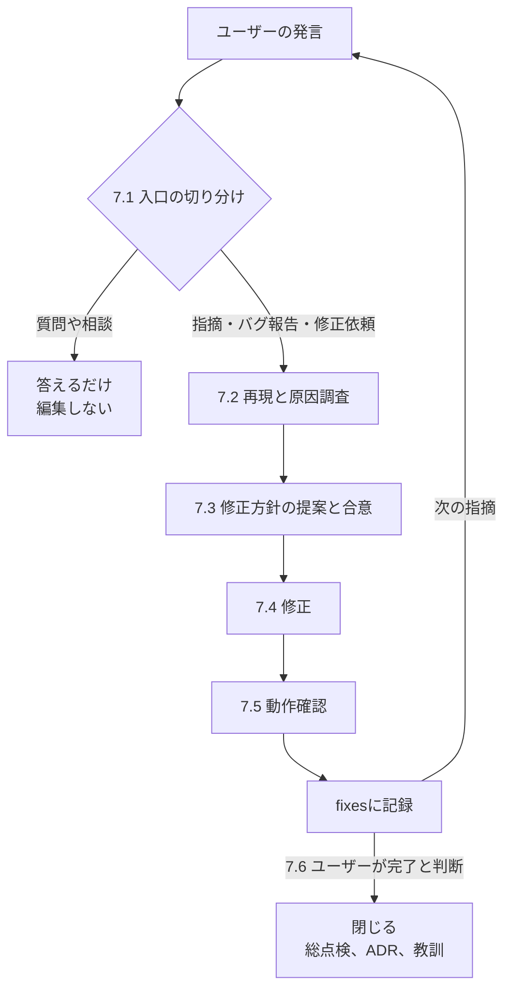

# 原則

このワークフローでは以下を一切禁止とする

- 本番環境の**変更・デプロイ**
- ユーザーの質問・指摘に対して、方針の合意を取らずにファイルを編集すること

# AIワークフロー

非自明なタスクを進める際の標準ワークフローを定義する。

## ワークフロー全体像

1. **設計** - ユーザーと共同で設計を行う
2. **実装計画** - 設計を細かいタスクに落とし込む
3. **設計・実装計画のレビュー** - 設計と実装計画が乖離していないかなどをレビュー
4. **実装** - 実装計画に沿って実装する
5. **ADR記録** - このワークフローでの重要な設計判断をドキュメントに残す
6. **教訓の抽出** - このワークフローで受けた指摘を一般化しauto memoryに残す
7. **確認・修正フェーズ** - ユーザーが実装や動作を確認してAIに質問や修正依頼を行う

## このワークフローで作成される主なファイル

- 設計 (`spec`) : `agent-tasks/ブランチ名/specs/YYYY-MM-DD-<TOPIC>.md`
- 実装計画 (`plan`) : `agent-tasks/ブランチ名/plans/YYYY-MM-DD-<TOPIC>.md`
- 設計・実装計画レビュー (`review`) : `agent-tasks/ブランチ名/review/YYYY-MM-DD-<TOPIC>.md`
- 修正経緯 (`fixes`) : `agent-tasks/ブランチ名/fixes/YYYY-MM-DD-<TOPIC>.md`
- 設計判断 (`adr`) : `docs/adr/<TICKET_ID>_<TITLE>.md`

## Red Flags — 手が滑っているサイン

以下が一つでも当てはまったら**止まって該当工程に戻る**。

- `spec` / `plan` を書かずに実装を始めようとしている
- テストを実行せず「たぶん動く」で完了にしようとしている
- 指定スキルを起動せず、要約や記憶で代替しようとしている

## 1. 設計

`/superpowers:brainstorming` スキルを利用して、ユーザーと共同で設計を行う。

- 設計(`spec`)を保存する場所: `agent-tasks/ブランチ名/specs/YYYY-MM-DD-<TOPIC>.md`

### 情報収集

設計は正確な情報を前提に行わなければならない。

- 与えられたタスクに必要な情報をリポジトリ内から収集すること
- 外部サービスやライブラリの仕様はcontext7(mcp)もしくはweb検索で最新の情報を取得すること

### ブレインストーミング

- 収集した正しい情報を元にユーザーと共同で設計判断を行う
  - UI/UX改善を含む場合は `Visual Companion` を利用すること
- 設計にはテスト戦略を含めること。TDDの要領で正しい動作を事前に定義しておくこと
- デプロイ手順の作成、ドキュメントの修正もスコープに含める
- **設計の基本原則**に従うこと
  - **シンプル第一**: あらゆる変更を可能な限りシンプルにする。コードへの影響を最小限に抑える
  - **最小限の影響**: 必要な箇所だけに手を加える。バグの混入を避ける
  - **怠慢の禁止**: 現在の実装に引きずられたり、一時しのぎの修正を行わない。シニアディベロッパーの基準で長期的に運用・拡張が容易なアーキテクチャを目指すこと
  - **深い洞察**: 表面的な問題の解決を目指すのではなく、問題の根本原因を見つけ、設計レベルでの改善が可能かを常に考えること
  - **普遍的な設計原則への準拠**: Clean Architecture, DDD, TDD, SOLIDの原則, GoFデザインパターンといった普遍的な設計原則に準拠すること

### specの作成

- `/japanese-tech-writing` スキルの方針に従い、人間とAIどちらも理解しやすいように記述すること
- 箇条書き、表、コードブロック、Mermaidを積極的に利用し、構造・関係・流れを視覚化する
- Mermaidの利用用途
  - `flowchart` : コンポーネント間の関係
  - `sequenceDiagram` : API、deploy、認証などの時系列
  - `stateDiagram-v2` : 状態遷移
  - `erDiagram` : テーブルのリレーション、データモデルの概念説明
  - `classDiagram` : クラス・オブジェクトの依存関係
  - `architecture-beta` : アーキテクチャ図

### 設計レビュー

- `spec` が完成したら一度すべての内容を確認し、ブレインストーミングでユーザーと決めた仕様・設計に準拠しているかを確認する。
- ユーザーと会話されていない設計判断が必要な記述があればユーザーに確認する

## 2. 実装計画

`/superpowers:writing-plans` スキルを利用して設計を実装計画に落とし込む。

- 実装計画(`plan`)を保存する場所: `agent-tasks/ブランチ名/plans/YYYY-MM-DD-<TOPIC>.md`

- デプロイ、ブランチのpushなど、既存環境への変更の適用はタスクに含めない

## 3. 設計・実装計画のレビュー

1. 「1. 設計」「2.実装計画」で作成した `spec` と `plan` を以下の観点でレビューする。 客観性を保つため、レビューは別の sub agent に委ねること。
  - レビュー(`review`)を保存する場所: `agent-tasks/ブランチ名/review/YYYY-MM-DD-<TOPIC>.md`
2. 修正の要否をステップバイステップでユーザーに質問する。ユーザーが判断しやすいよう、質問には目的、経緯、トレードオフなどの背景情報を含める
3. 重大な指摘があれば「1. 設計」「2.実装計画」に差し戻し、ユーザーと再度設計をし直すこと。

### レビュー観点
- ドリフト検知: ユーザーとAIで brainstorming して決めた仕様・設計と食い違っていないか
- 情報の正確性: Context7、web検索で公式の最新情報を確認し、内容の正確性をチェックする
- 全体的な整合性: 新しい変更が、既存のアーキテクチャ、データモデル、API、命名規則、コンポーネントの役割分担と矛盾なく調和しているか
- 根本解決と技術負債の回避: その場しのぎの修正になっていないか。複雑性を上げたり、将来的な技術負債を生んだりしていないか
- 再利用性と共通化: 車輪の再発明を避け、既存の共通コンポーネントやユーティリティを適切に活用しているか
- 破壊的変更の検知: リソースの強制置換など、既存の稼働中インフラを停止・破壊してしまう実装が含まれていないか
- セキュリティと最小権限: IAMポリシーやセキュリティグループに不要な権限がついていないか
- 将来への影響: 将来的な機能拡張やスケールアウトを不必要に妨げる設計になっていないか
- 修正項目をユーザーに報告

## 4. 実装

`/superpowers:subagent-driven-development` スキルを利用してプランを実装すること

- 追加の設計判断が必要になった場合はそのまま進めず、ユーザーに質問すること
- 設計・計画の変更が必要になった場合は、ユーザーの確認をとって `spec` 、 `plan` を修正すること

## 5. 重要な設計判断をドキュメントに残す

重要な設計判断を[MADR (Markdown Architectural Decision Records)](https://adr.github.io/madr/) を利用して、 `docs/adr/<TICKET_ID>_<TITLE>.md` に残す。

- 今回の修正において、重要と思われる設計判断を抽出し、どれをADRに残すかをユーザーと相談する
- テンプレートはfullとminimalの2パターン。内容に応じて選択する。 (基本は minimal。full出ないと説明しきれない場合のみfull)
  - full: https://raw.githubusercontent.com/adr/madr/refs/tags/4.0.0/template/adr-template.md
  - minimal: https://raw.githubusercontent.com/adr/madr/refs/tags/4.0.0/template/adr-template-minimal.md
- ADRは日本語で記述する
- ADRのレビューとcommitはユーザーにゆだねる。

## 6. 教訓の抽出

ワークフロー内でユーザーから受けた指摘で、一般的に他のタスクにも適用すべきものを教訓として auto memory に残す。

- 教訓は本質的な学びとなるよう抽象化し、関連する既存メモリと結びつける
- auto memory を一度俯瞰し、必要であれば教訓の統合や廃止を行う

## 7. 確認・修正フェーズ

実装まで完了した段階でユーザーによる確認・修正フェーズに入る

- 修正経緯(`fixes`)を保存する場所: `agent-tasks/ブランチ名/fixes/YYYY-MM-DD-<TOPIC>.md`

### このフェーズの原則

- **合意なく編集を始めない** : 質問や相談は答えるだけで終わらせ、修正は方針の合意を得てから着手する
- **`spec` と `plan` は「あるべき姿」に保つ** : 修正によって変更された設計や実装を `spec` `plan` に反映する

### フロー



### 7.1 入口の切り分け

ユーザーの発言をまず2つに分類する。

**質問や相談に対していきなり修正を始めてはならない。** 相談は修正の依頼ではない。

| 入口 | 例 | 進め方 |
|------|---|--------|
| 質問・相談 | 「なぜこの実装にしたのか」「Aのほうがよくないか」 | 答えるだけ。コードもドキュメントも触らない |
| 指摘・バグ報告・修正依頼 | 「XXが動かない」「XXをYYに修正して」 | 7.2に進む |

- 相談の中に修正の意図が混ざっていて判断がつかない場合は、修正するかどうかをユーザーに確認する。推測で着手しない
- 指摘が複数同時に来た場合は `agent-tasks/ブランチ名/fixes/YYYY-MM-DD-<TOPIC>.md` に一覧化し、優先度を合意してから1件ずつ回す。まとめて着手すると、どの変更がどの結果をもたらしたかを切り分けられなくなる

### 7.2 再現と原因調査

- `/superpowers:receiving-code-review` を利用し、指摘事項を技術的に検証する
- `/superpowers:systematic-debugging` を利用し、原因究明を試みる
- ソースコード、環境のログから事実を洗い出し、環境に変更を加えない範囲で状況の再現を試みること


> [!NOTE]  
> 指摘は症状の報告であって修正方針ではない。「動作がおかしい」なら、期待する状態をユーザーに確認してから原因を追う。

### 7.3 修正方針の提案と合意

**このゲートを通らずにファイルを編集しない。**

- 提案に含めるもの: 原因、修正方針、影響範囲(触るファイルと層)、`spec` の仕様が変わるかどうか
- 指摘どおりに直すと別の要件を壊す場合は、その衝突を伝えて代替案を出す
- 方針が複数ありトレードオフがある場合は、推奨案を明示してユーザーに選ばせる
- 文言修正のように相談の余地がないものは、提案を省いて修正に進んでよい

### 7.4 修正

- 合意した方針で修正を行う。
- 合意した方針から外れる必要が生じたら、そのまま進めずユーザーに確認する
- 修正のスコープは最小に保ち、ついでのリファクタリングを混ぜない。

### 7.5 確認

- 本番環境への変更は行わず、修正内容に文法的ミスがないか、テストが通るかをチェックする

### 7.6 記録

修正1件ごとに `agent-tasks/ブランチ名/fixes/YYYY-MM-DD-<TOPIC>.md` へ追記する。


| 対象 | 更新するタイミング |
|------|-----------------|
| `fixes` | 修正するたびに必ず |
| `spec` | 「あるべき姿」が変わったときだけ |
| `plan` | 実装計画そのものが変わったときだけ |
| ADR、教訓 | 7.7でまとめて整理する(修正ごとには触らない) |

```markdown
## FIX-01 <指摘の要約>

- 指摘: ユーザーの指摘内容の要点
- 原因: 実証された原因(推測は書かない)
- 方針: 合意した修正方針
- 対応: 変更した内容と対象ファイル
- 確認: 指摘事項が解消したことの確認方法と結果
- 影響: `spec` `plan` の更新有無
```

### 7.7 修正フェーズを閉じる

ユーザーが修正の完了を判断したら、蓄積した修正を通しで点検してから終える。

1. **総点検**: このワークフローで行った変更・操作を対象として包括的なレビューを行う。`/superpowers:receiving-code-review` を利用すること。
2. **ADRの整理**: タスク全体の設計判断が変わった場合のみ、既存のADRを最終的な決定として書き直す。修正1件ごとにADRを起こさず、経緯もADRに書かない。「当初Aだったが指摘でBにした」という経過は `fixes` に閉じる
3. **教訓の抽出**: 修正で受けた指摘から教訓を抽出し、auto memory に残す。指摘には、1〜7で拾えなかった前提のズレが現れている。ワークフロー本体より教訓が濃い場所なので、必ず一度は振り返る